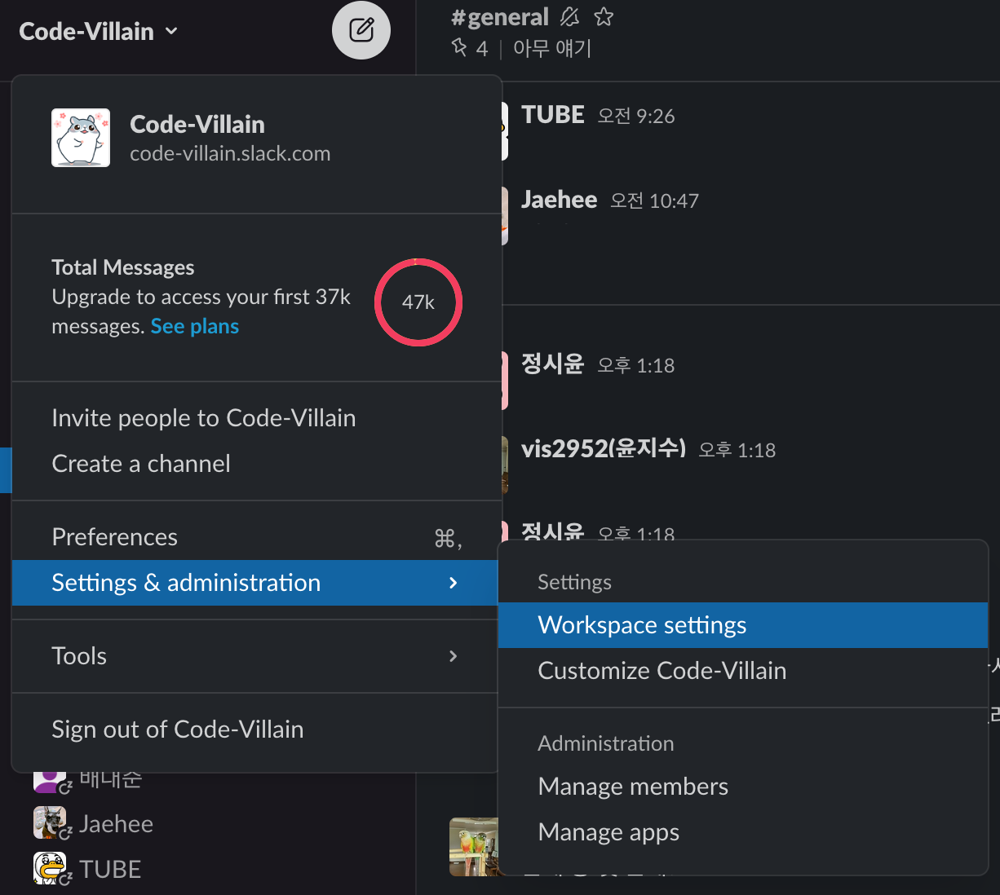
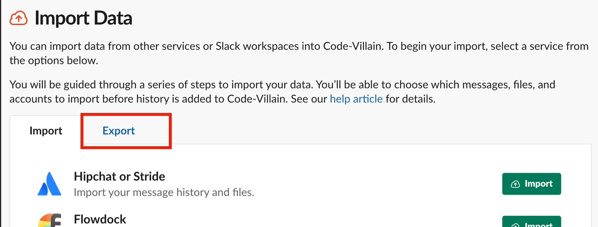
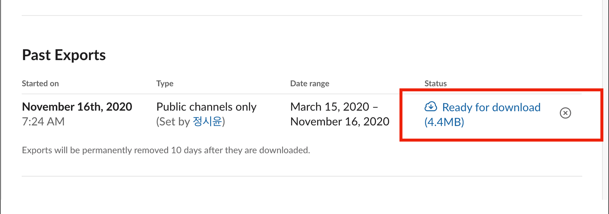

# Slack Json to Markdown
Slack doesn't erase conversation history even if it's a **free plan**! (You just can't see it in the Slack App.) It is saved as json file.

This simple application helps you change the json conversation to markdown!!

https://siyoon210.github.io/slack-json-to-markdown/

## sample

[Sample Markdown Link](https://github.com/code-villain/effective-java/blob/master/keywords/keywords_backup.md)

## Usage
### 0. Your account type must be 'Workspace Admin' or 'Workspace Owner'.
### 1. Export and Download json files

### 2. Convert Json files to Markdown

https://siyoon210.github.io/slack-json-to-markdown/
